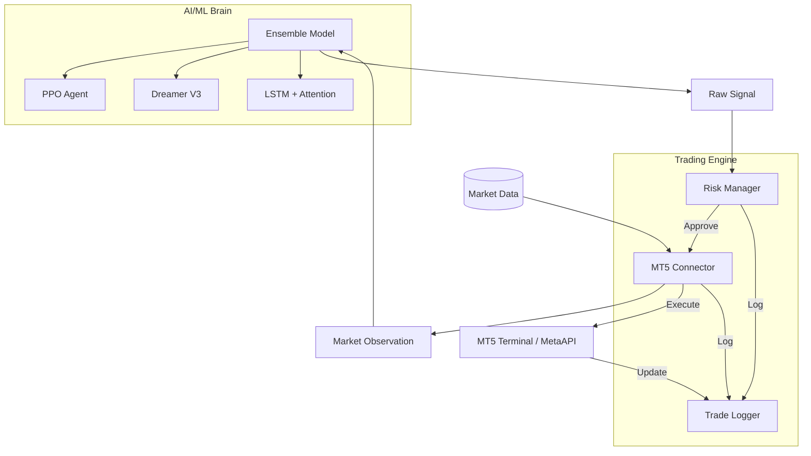

# System Architecture

The MT5 AI/ML Trading Bot is designed with a modular, decoupled architecture to ensure reliability, testability, and cross-platform support.

## High-Level Overview

## Signal Flow

1.  **Ingestion**: `MT5Connector` fetches the latest OHLCV data from MetaTrader 5.
2.  **Observation**: Data is processed into features (140+ indicators).
3.  **Inference**: `EnsembleModel` aggregates predictions from RL and Neural Network agents.
4.  **Validation**: `RiskManager` runs a 6-layer filter cascade (Circuit Breakers, Daily Loss, etc.).
5.  **Execution**: Validated signals are converted into orders via `MT5Connector`.
6.  **Persistence**: All events (Signals, Trades, Rejections) are recorded in the `TradeLogger`.

## Component Responsibilities

- **Core**: Configuration management and system-wide monitoring.
- **Models**: Architecture definition, training, and inference.
- **Environment**: Gymnasium-compatible wrappers for RL training.
- **Trading**: Platform connectivity and risk authority.
