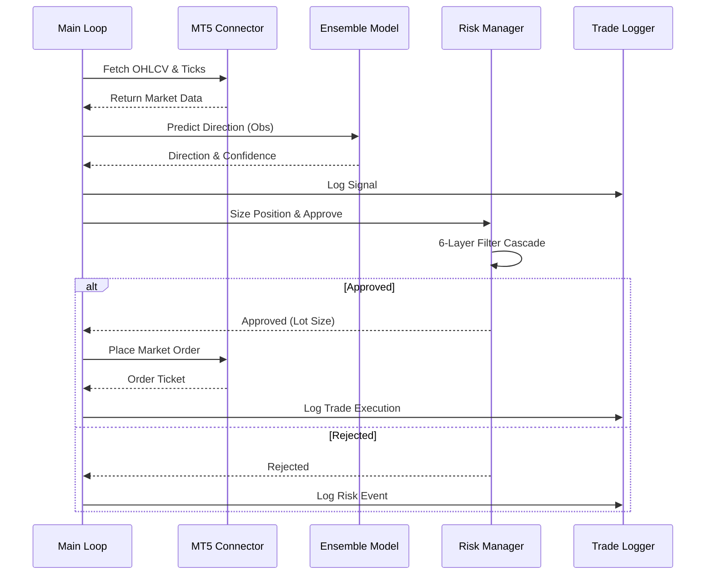

# Architecture

This document describes the high-level architecture of the MT5 AI/ML Trading Bot.

## Overview

The system is composed of several modules:

- **Core**: Configuration, monitoring, and logging.
- **Trading**: MT5 connector, order management, and risk management.
- **Models**: AI/ML models (Ensemble, PPO, LSTM).
- **Environment**: Gymnasium environment for reinforcement learning.

## System Diagram

The following diagram illustrates the interaction between the core components during a live trading session.

## Module Responsibilities

### 1. Core Module
- **Configuration**: Handles `.env` and environment variables.
- **Monitoring**: Equity tracking and Telegram alerts.
- **Logging**: SQLAlchemy-based trade and signal persistence.

### 2. Models Module
- **Ensemble**: Combines multiple RL and Deep Learning models.
- **Dynamic Weighting**: Adjusts model influence based on recent performance (Sharpe Ratio).

### 3. Trading Module
- **Connector**: Abstracts MT5 SDK and MetaAPI.
- **Risk Management**: Enforces strict drawdown and allocation rules.
- **Order Management**: Executes and tracks market orders.
